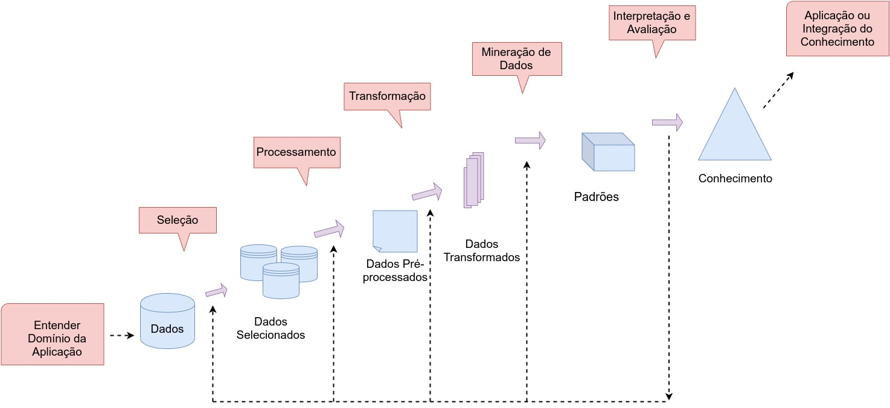

## Disciplina de Projeto Graduação I e II
### Orientador: Prof. Drº Ary Henrique de Morais
### Coorientadora: Prof. Drª Glenda Michele Botelho
### Especialista: Prof. Drª Paula Benevides de Morais

<!-- PROJECT SHIELDS -->
<!--
*** I'm using markdown "reference style" links for readability.
*** Reference links are enclosed in brackets [ ] instead of parentheses ( ).
*** See the bottom of this document for the declaration of the reference variables
*** for contributors-url, forks-url, etc. This is an optional, concise syntax you may use.
*** https://www.markdownguide.org/basic-syntax/#reference-style-links
-->


<!-- PROJECT LOGO -->
<br />
<p align="center">
  <a href="https://github.com/othneildrew/Best-README-Template">
    
  </a>

  <h3 align="center">Descoberta de Conhecimento em Base de Dados de Fungos</h3>

  <p align="center">
    Uma parceria Instituto de Computação Aplicada, Fábrica de Software e Laboratório de Microbiologia UFT
    <br />
    <!-- <a href="https://github.com/othneildrew/Best-README-Template"><strong>Explore the docs »</strong></a> -->
    <!-- <br /> -->
    <br />
    <!-- <a href="https://github.com/othneildrew/Best-README-Template">View Demo</a>
    ·
    <a href="https://github.com/othneildrew/Best-README-Template/issues">Report Bug</a>
    ·
    <a href="https://github.com/othneildrew/Best-README-Template/issues">Request Feature</a> -->
  </p>
</p>

### Proposta do Trabalho:
A partir de uma base de dados integrada com informações sobre fungos leveduriformes coletadas em regigões de cerrado (estados do Tocantins e Mato Grosso) seria possível agrupar essas leveduras a partir de alguma característica em comum?

Os fungos são organismos que por anos foram confundidos com plantas. Entretanto, esses possuem características tão peculiares que foram agrupados em um reino a parte: o Reino Fungi. Considerando a importância dos fungos já descobertos e a imensa quantidade ainda por catalogar, este trabalho visa caracterizar diferenças e semelhanças de fungos leveduriformes encontrados em frutos de Buriti e folhas de Babaçu, na região dos estados do Tocantins e Mato Grosso. Tal estudo tem por objetivo aplicar técnicas e procedimentos de Descoberta de Conhecimento que seja útil e compreensível a partir da aplicação iterativa e interativa da metodologia *KDD*. Dessa forma, expõe-se algumas das fases do processo *KDD* sob a percepção de que este é amplamente utilizado pela comunidade acadêmica.

### Objetivos:
O principal objetivo deste projeto é realizar o processo de descoberta de conhecimento em uma base de dados de fungos leveduriformes com o intuito de encontrar informações interessantes e úteis. Para isso, os seguintes objetivos específicos precisam ser atendidos:
1. Estudar fungos, suas características e importância para a biodiversidade.
2. Aplicar métodos estatísticos de análise de dados para limpeza, transformação e integração dos mesmos.
3. Estudar e aplicar técnicas de Mineração de Dados na base de fungos.
4. Aplicar técnicas de Descoberta de Conhecimento em Bases de Dados, na base de fungos;

### Hipóteses:
* **H1:** É possível estabelecer relações entre fungos coletados na mesma localidade? E entre fungos coletados em localidades diferentes, seria possível caracterizar essa diferenças e/ou semelhanças?
* **H2:** É possível agrupar esses fungos por alguma característica semelhante?
* **H3:** A partir das características espaciais e fisiológicas dos fungos, é possível verifcar comportamentos semelhantes em reações a determinados compostos?
* **H4:** Sobre a diversidade dos fungos catalogados pelo LAMBIO/UFT, quantos/quais destes ainda não possuem registro em coleções internacionais de cultura? Quais características proeminentes destes e como correlacioná-los ao meio em que vivem?

Sobre o projeto e sua estrutura:
Alguns dos arquivos *ipynb* existem apenas em função de testar algumas funcionalidades das bibliotecas utilizadas nesse Trabalho.

##### Para ver o arquivo definitivo do trabalho, abra o **Covid19.ipynb** que está na raiz do projeto. Caso tenha dificuldades em abrir o arquivo direto pelo GitHub, tente copiar a URL do mesmo e colar no site [NbViewer](https://nbviewer.jupyter.org/).

##### Os dados em *.csv* estão todos na pasta *data/* e são essencialmente partes do arquivo original (salvo alterações diminutas) baixado na plataforma do Governo Federal.


### Links importantes:
[Stanford Dataset Collection](http://snap.stanford.edu/data/)

[Base de Dados Covid-19 do SUS](https://covid.saude.gov.br/). Mais informações em [SUS Analítico](https://susanalitico.saude.gov.br/).

[Instituto Nacional de Pesquisas Espaciais](http://www.inpe.br/).


### Destaques:
- 
-
-

### Instruções para instalação de pacotes:
Recomendamos fortemente o uso do gerenciador de pacotes [Conda](https://docs.conda.io/projects/conda/en/latest/user-guide/install/) para instalação dos pacotes contidos no arquivo *requirements.txt*

A instalação pode ser feita um pacote por vez:

```sh
$ conda install pandas
$ conda install networkx
$ conda install bokeh
```
ou simplesmente criando um ambiente virtual e instalando todos os pacotes a partir do arquivo *requirements.txt*:
```sh
$ conda create --name <escolha-nome-do-ambiente> --file requirements.txt
$ conda activate <nome-do-ambiente-escolhido-anteriormente>
```

## Contributing
*Pull Requests* são sempre bem vindos. Para maiores alterações, favor abrir uma *issue* para discussão do que gostaria de ser adicionado/alterado/removido.

## License
[MIT](https://choosealicense.com/licenses/mit/)

### Palavras-chaves:
*KDD*, *Descoberta de Conhecimento*, *Fungos Leveduriformes*, *Clustering*, *Algoritmos de Agrupamento*